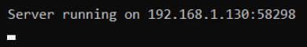

# Controller Server
Mängupuldi funktsionaalsust pakkuva rakenduse serveriprogramm.

## Projektist
Projekti eesmärk on mängupuldi puudmisel see asendada nutiseadmega.  
Projekt on loodud Martin Sõmeri poolt Tallinna Ülikooli bakalaureusetöö raames.

## Kasutatud tehnoloogiad
* [vXboxInterface teek](https://github.com/shauleiz/vXboxInterface)
* Windows Sockets 2 teek
* Dev-C++ integreeritud programmeerimiskeskkond

## Kasutusjuhend
* Lae ScpVBus draiver alla [siit](https://github.com/shauleiz/ScpVBus/releases)
* Paigalda ScpVBus draiver vastavalt selle juhendile
* Lae serveriprogramm alla [siit](https://github.com/martinsomer/ControllerServer/releases)
* Lisa serveriprogrammi jaoks tulemüüri erand
* Ava serveriprogramm
* Loo ühendus [rakendusega](https://github.com/martinsomer/controller)

## Ekraanipildid

## Litsents
[MIT litsents](LICENSE.txt)